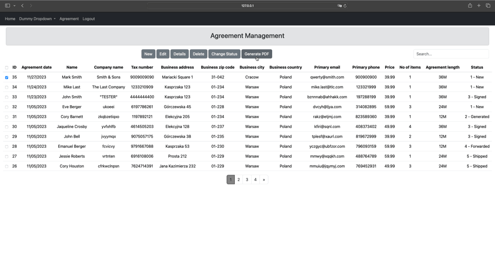

# Management System
### Introduction
The Management System is designed to streamline the process of collecting data, generating agreements, and tracking
progress. It provides essential functionalities for managing agreements, including creation, editing, display, and deletion.

The idea was to create a system that would allow for collecting data to generate an agreement and to track the progress,
ensuring a follow-up process after signing an agreement.

This is a closed system, so there is no user registration page.
The agreement functionality is available after login in.

First the basic functionality was added that would allow to:
- add a new agreement,
- edit an agreement,
- display all the details of an agreement,
- delete an agreement.

This was accomplished by using CreateView, UpdateView, DetailView and DeleteView.

The table view was created to display all agreements. The django-tables2 package was installed.
The buttons were added to enable the basic functionality. The checkbox column has been added to allow selecting
an agreement to perform available actions.

The django-filter package was installed to allow to filter data in the table to make finding the one between many
agreements possible.
 
The django-htmx package was installed to filter data and display it in the table without reloading the page.

The django-crispy-forms and crispy-bootstrap5 packages were installed to make forms easier to manage.

The 'Change Status' button was implemented to provide a convenient way to update the status of one or multiple
agreements simultaneously.

Finally, functionality to generate an agreement was added. The packages: fpdf and pypdf were installed
to accomplish the task.

The agreement pdf template with blank spaces is filled in with values from the selected agreement.

### Minor features
* Custom server side validation for the additional_info field.

* Custom client side validation for the additional_info field.

* Cleaning the data for first_name and last_name fields.

* Templatetags to be able to format data while displaying it. Used in agreement_details.html to add a space
every 3 digits for phone numbers.

### Result

Login and logout

Pagination, sorting and filtering

Actions for no checkmarks

Actions for one checkmark

Actions for many checkmarks

